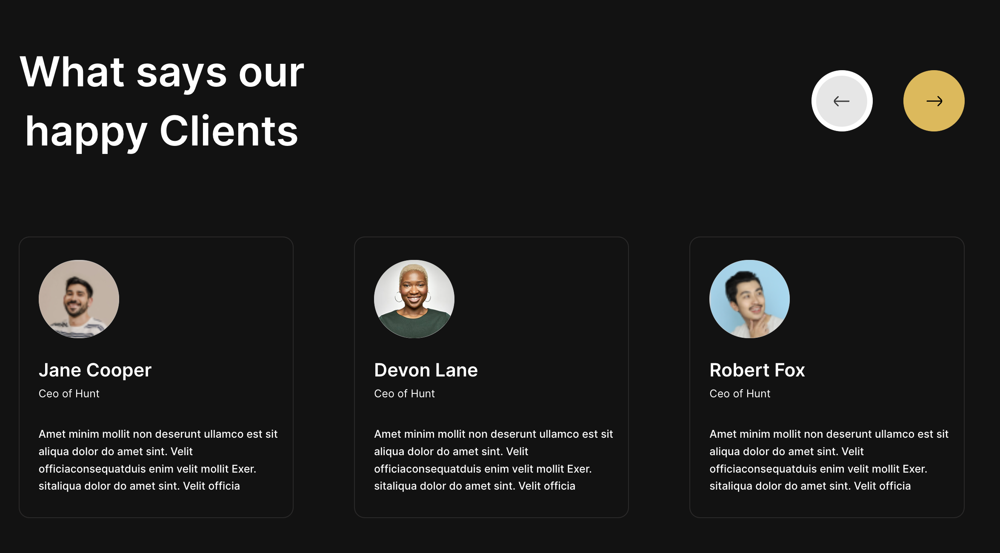

# Law Firm Landing Page

This project is a landing page template for a law firm built using ReactJS.

## Table of Contents

- [Introduction](#introduction)
- [Features](#features)
- [Screenshot](#screenshot)
- [Getting Started](#getting-started)
- [Prerequisites](#prerequisites)
- [Installation](#installation)
- [Usage](#usage)
- [Contributing](#contributing)
- [License](#license)

## Introduction

The Law Firm Landing Page Using ReactJS is a template designed for law firms to showcase their services, expertise, and contact information. It provides a professional and modern layout with sections for highlighting key features, displaying testimonials, and presenting team members.

## Features

- Clean and professional design
- Responsive layout for optimal viewing on various devices
- Sections for services, testimonials, team members, and contact information
- Easy-to-customize components for adding and editing content

## Screenshot





## Getting Started

### Prerequisites

Before you begin, ensure you have Node.js and npm installed on your system.

### Installation

1. Clone the repository:

```bash
git clone https://github.com/BoddepallyVenkatesh06/Law-Firm.git
cd law-firm-landing-page
```

2. Install dependencies:

```bash
npm install
```

## Usage

To start the development server, run:

```bash
npm start
```

This will start the application in development mode at `http://localhost:3000`.

To build the production application, run:

```bash
npm run build
```

This will create a production-ready build in the `build` directory.

## Contributing

Contributions are welcome! If you'd like to contribute to the Law Firm Landing Page Using ReactJS, please follow these steps:

1. Fork the project.
2. Create a new branch: `git checkout -b feature-name`.
3. Commit your changes: `git commit -m 'Add some feature'`.
4. Push to the branch: `git push origin feature-name`.
5. Submit a pull request.

## License

This project is licensed under the MIT License - see the [LICENSE](LICENSE) file for details.
